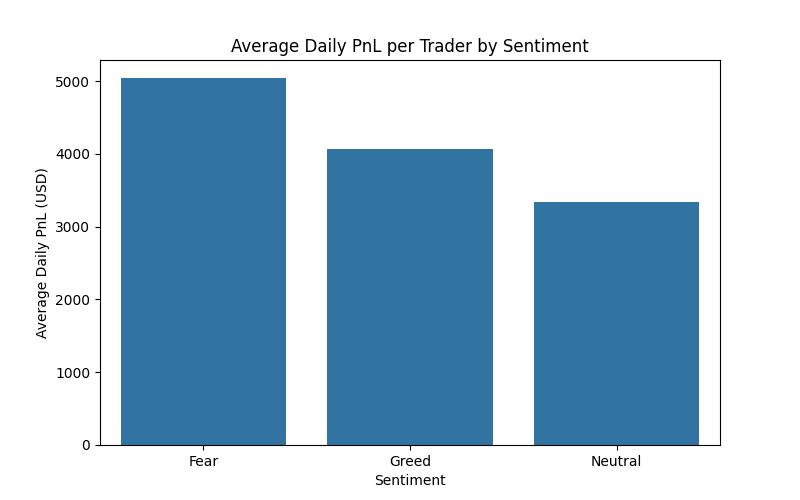
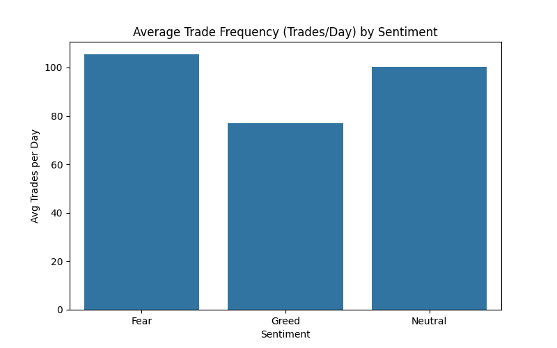

# PrimeTrade Data Science Intern Assignment
**Trader Performance vs Market Sentiment Analysis**

## Overview
This repository contains the analysis codebase for understanding how the Bitcoin Fear & Greed Index impacts trader behavior and performance on Hyperliquid.

The data consists of two datasets:
1. `fear_greed_index.csv` - Daily classification of Bitcoin market sentiment.
2. `historical_data.csv` - Granular Historical trader data on Hyperliquid.

*(Note: "leverage" was not present in the historical dataset provided, hence we analyzed trade sizes using `Size USD` as the proxy for positional sizing.)*

## Key Visualizations
Below is a rapid glimpse of the correlations between trader performance, volume/size behavior, and Bitcoin sentiment:

  
  

*(All 6 generated analytical charts can be explored within the `charts/` directory.)*

## File Structure
- `analysis_notebook.ipynb` - The primary Jupyter Notebook with end-to-end data preparation, engineered metrics, descriptive visual analysis, segmentation, and a basic predictive model.
- `analysis.py` - Core analysis script that generates key metrics and static `.png` visualizations.
- `dashboard.py` - A lightweight Streamlit app allowing interactive exploration of the historical data vs. sentiment.
- `writeup.md` - A one-page written summary outlining the methodology, 3 main insights, and 2 actionable strategy rules of thumb based on findings.
- `charts/` - Output directory containing generated static visualizations.

## Setup Instructions
1. Install Python 3.9+ and place the CSV files (`fear_greed_index.csv` and `historical_data.csv`) into the root directory.
2. Run `pip install -r requirements.txt`.

## How to Run
1. **Static Analysis & Charts**: Execute `python analysis.py` to produce statistical outputs directly in the terminal and save static charts to the `charts/` directory.
2. **Jupyter Notebook**: Run `jupyter notebook analysis_notebook.ipynb` to explore the step-by-step EDA and execute sections interactively.
3. **Interactive Dashboard**: Run `streamlit run dashboard.py` to open the local web application for live visualization.
